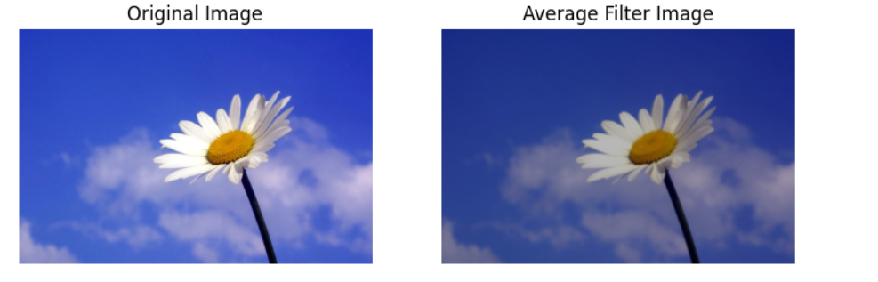
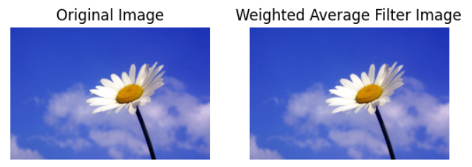
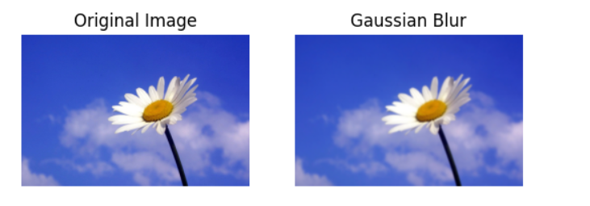
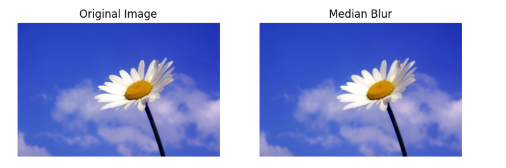
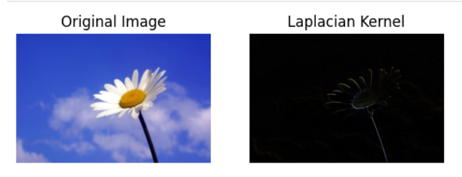
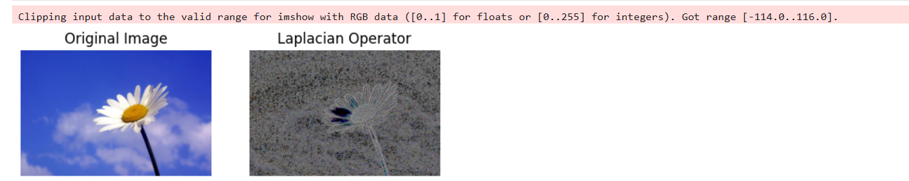

# 5-Record-Implementation-of-Filters
# Image Smoothing and Sharpening Using OpenCV

## Aim

To write a Python program using OpenCV to apply different smoothing filters (Averaging, Weighted Averaging, Gaussian, Median) and sharpening filters (Laplacian Kernel and Laplacian Operator) for image enhancement, and display each result separately along with the original image for comparison.

---

## The program performs the following operations:

- Read and display an input image  
- Apply Averaging filter  
- Apply Weighted Averaging filter  
- Apply Gaussian filter  
- Apply Median filter  
- Apply Laplacian sharpening using kernel  
- Apply Laplacian operator  
- Display all outputs for comparison  

---

##  Software Used

- Anaconda – Python 3.7  
- Jupyter Notebook / VS Code  
- OpenCV (cv2)  
- NumPy  
- Matplotlib  

---

##  Algorithm

### Step 1:
Import the required libraries: OpenCV, NumPy, and Matplotlib.

### Step 2:
Read the input image (e.g., `image.jpg`).

### Step 3:
Convert the image from BGR to RGB format for display.

### Step 4:
Apply Averaging Filter using `cv2.blur()`.

### Step 5:
Apply Weighted Averaging Filter using a custom kernel with `cv2.filter2D()`.

### Step 6:
Apply Gaussian Filter using `cv2.GaussianBlur()`.

### Step 7:
Apply Median Filter using `cv2.medianBlur()`.

### Step 8:
Apply Laplacian Sharpening using Kernel with `cv2.filter2D()`.

### Step 9:
Convert image to grayscale and apply Laplacian Operator using `cv2.Laplacian()`.

### Step 10:
Display all filtered images using a grid layout for comparison.

---
## Program: 
### Developed By
- **Name:** STARBIYA S
- **Register No:** 212223040208

---
### 1. Smoothing Filters
i) Using Averaging Filter
```py
import cv2
import matplotlib.pyplot as plt
import numpy as np
image1=cv2.imread("Flower.jpg")
image2=cv2.cvtColor(image1,cv2.COLOR_BGR2RGB)
kernel=np.ones((11,11),np.float32)/169
image3=cv2.filter2D(image2,-1,kernel)
plt.figure(figsize=(9,9))
plt.subplot(1,2,1)
plt.imshow(image2)
plt.title("Original Image")
plt.axis("off")
plt.subplot(1,2,2)
plt.imshow(image3)
plt.title("Average Filter Image")
plt.axis("off")
plt.show()
```

ii) Using Weighted Averaging Filter
```py
kernel1=np.array([[1,2,1],[2,4,2],[1,2,1]])/16
image2=cv2.cvtColor(image1,cv2.COLOR_BGR2RGB)
image3=cv2.filter2D(image2,-1,kernel1)
plt.subplot(1,2,1)
plt.imshow(image2)
plt.title("Original Image")
plt.axis("off")
plt.subplot(1,2,2)
plt.imshow(image3)
plt.title("Weighted Average Filter Image")
plt.axis("off")
plt.show()
```

iii) Using Gaussian Filter
```py
gaussian_blur=cv2.GaussianBlur(image2,(33,33),0,0)
plt.subplot(1,2,1)
plt.imshow(image2)
plt.title("Original Image")
plt.axis("off")
plt.subplot(1,2,2)
plt.imshow(gaussian_blur)
plt.title("Gaussian Blur")
plt.axis("off")
plt.show()
```

iv)Using Median Filter
```py
median=cv2.medianBlur(image2,13)
plt.figure(figsize=(9,9))
plt.subplot(1,2,1)
plt.imshow(image2)
plt.title("Original Image")
plt.axis("off")
plt.subplot(1,2,2)
plt.imshow(median)
plt.title("Median Blur")
plt.axis("off")
plt.show()
```
### 2. Sharpening Filters
i) Using Laplacian Linear Kernal
```py
kernel2=np.array([[-1,-1,-1],[2,-2,1],[2,1,-1]])
image3=cv2.filter2D(image2,-1,kernel2)
plt.subplot(1,2,1)
plt.imshow(image2)
plt.title("Original Image")
plt.axis("off")
plt.subplot(1,2,2)
plt.imshow(image3)
plt.title("Laplacian Kernel")
plt.axis("off")
plt.show()
```

ii) Using Laplacian Operator
```py
laplacian=cv2.Laplacian(image2,cv2.CV_64F)
plt.subplot(1,2,1)
plt.imshow(image2)
plt.title("Original Image")
plt.axis("off")
plt.subplot(1,2,2)
plt.imshow(laplacian)
plt.title("Laplacian Operator")
plt.axis("off")
plt.show()
```

##  Output

### Smoothing Filters

- Averaging filter produces blurred image
  


- Weighted averaging provides smoother result with less distortion
  
  

- Gaussian filter preserves edges better while reducing noise
 
 

- Median filter removes salt-and-pepper noise effectively  



###  Sharpening Filters

- Laplacian kernel enhances edges and fine details
  

  
- Laplacian operator detects edges clearly in grayscale  



---

##  Result

Thus, smoothing filters and sharpening filters are successfully implemented using OpenCV.

The smoothing filters reduce noise and improve image quality, while sharpening filters enhance edges and details for better feature extraction.